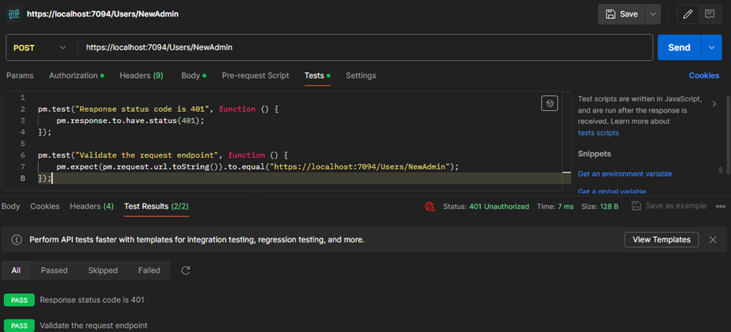

### VIDEO GAMES API

Gadi Medero

Preview of Swagger, how the endpoints looks like.

### Proofs of every endpoint with POSTMAN.

### (C) POST

Create a new game in the Repository.

Possible errors:

Existing ID.

Existing Name.

Wrong Platform.

Wrong Price.

### (R) GET

Retrieval all video games from the repository.

Retrieval a single video game by its ID from the repository.

Error by not found ID.

### (U) PUT

Apdate an existing video game to the repository.

Non existing video game error:

### (D) DELETE

Delete an existing video game from the repository.

### LAST UPDATES!

Swagger preview.

### New User and Admin accounts feature

### New restrictions

No duplicates are allowed, authentication restrictions and strong password rules.

Only admin users with their Token can generate other admin accounts and post, update and delete games.

Everybody can register a normal account.

If your account does not exist or your credentials are wrong, we will notify you of the error.

This API was tested on Postman (for learning purposes) and with NUnit6.

## Last Updates

Code 201 Created, for the creation of a new game through the method GetById, that can be used at the same time to confirm the existence of the game that we add to the storage with the endpoint POST.

* Testing

1. Create two new games and return Code 201 Created.

2. Verify that the games were created successfully and return Code 200 OK.

3. Verify that the names of the games that were created coincide with the names of the games that were returned in the last check. 

Thank you!